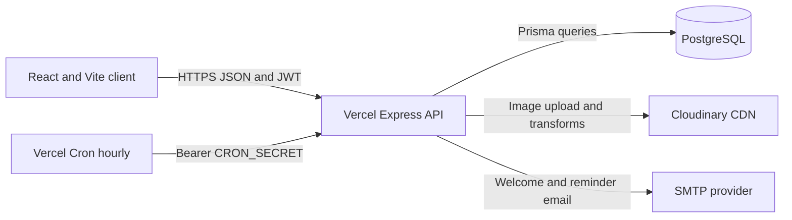

# Task Manager

A full-stack task manager with a React/Vite client, Express API, PostgreSQL database, Prisma ORM, JWT authentication, and Cloudinary image delivery.

## Local Development

1. Install dependencies from the repository root: `npm install`, `npm install --prefix backend`, and `npm install --prefix frontend`.
2. Copy `backend/.env.example` to `backend/.env` and configure the database, JWT, and Cloudinary values. SMTP values are required to send email.
3. Apply pending local database migrations with `npm.cmd --prefix backend run db:deploy`.
4. Start both applications with `npm.cmd run dev`.

The Vite client normally runs at `http://127.0.0.1:5173`; the API runs at `http://127.0.0.1:4000`. The client can use `VITE_API_URL` to target another API origin.

## API

The API accepts JSON and uses `Authorization: Bearer <token>` for protected routes.

| Method | Endpoint | Purpose |
| --- | --- | --- |
| POST | `/api/auth/register` | Create an account and return an access token |
| POST | `/api/auth/login` | Authenticate and return an access token |
| GET | `/api/tasks` | List the authenticated user's tasks |
| POST | `/api/tasks` | Create a task |
| GET | `/api/tasks/:id` | Retrieve one owned task |
| PUT or PATCH | `/api/tasks/:id` | Update an owned task |
| DELETE | `/api/tasks/:id` | Delete an owned task and its Cloudinary image |
| POST | `/api/uploads/task-image` | Upload a JPEG, PNG, or WebP image as multipart field `image` |

Import [`docs/task-manager.postman_collection.json`](docs/task-manager.postman_collection.json) into Postman for request examples. Set the collection's `baseUrl`, `email`, and `password` variables before running it.

## Architecture

Task queries are scoped to the authenticated user. Image bytes are held in memory by the API during upload; only Cloudinary URLs are stored in PostgreSQL. Scheduled reminders use a database claim so overlapping cron invocations do not send the same reminder concurrently.

## Environment Variables

Configure secrets in local `backend/.env` for development and in the Vercel project's Environment Variables for deployment. Never commit real `.env` files.

| Variable | Used by | Notes |
| --- | --- | --- |
| `DATABASE_URL` | Backend | PostgreSQL connection string |
| `JWT_SECRET` | Backend | At least 32 bytes |
| `CLOUDINARY_CLOUD_NAME` | Backend | Cloudinary cloud name |
| `CLOUDINARY_API_KEY` | Backend | Cloudinary API key |
| `CLOUDINARY_API_SECRET` | Backend | Cloudinary API secret |
| `FRONTEND_ORIGIN` | Backend | Exact deployed frontend origin; comma-separated origins are supported |
| `VITE_API_URL` | Frontend | Deployed backend origin, without `/api` |
| `SMTP_HOST`, `SMTP_PORT` | Backend | SMTP server and port |
| `SMTP_SECURE` | Backend | `true` for implicit TLS, commonly port 465; `false` for STARTTLS, commonly port 587 |
| `SMTP_USER`, `SMTP_PASSWORD` | Backend | SMTP authentication |
| `EMAIL_FROM` | Backend | Verified sender address and optional display name |
| `APP_URL` | Backend | Public frontend URL used in email links |
| `CRON_SECRET` | Backend and Vercel | Random secret used to authorize the reminder endpoint |

Without SMTP configuration, registration still works but welcome email delivery is skipped, and the reminder endpoint returns `503`. Email delivery must be verified with the selected SMTP provider before claiming it is live.

## Vercel Deployment

Deploy the monorepo as two Vercel projects connected to this GitHub repository:

1. **Backend project:** set the project Root Directory to `backend`. The install `postinstall` generates Prisma Client. Add `DATABASE_URL`, `JWT_SECRET`, all three Cloudinary variables, `FRONTEND_ORIGIN`, SMTP variables, `EMAIL_FROM`, `APP_URL`, and `CRON_SECRET` in the Vercel dashboard.
2. Apply the database migration using `npm run db:deploy` from the backend package with the production `DATABASE_URL`. Do this before enabling reminder traffic; do not use `db:migrate` against production.
3. **Frontend project:** set Root Directory to `frontend` and configure `VITE_API_URL` to the deployed backend origin, for example `https://your-api.vercel.app`.
4. After the frontend URL is assigned, set backend `FRONTEND_ORIGIN` and `APP_URL` to that exact URL and redeploy the backend.
5. `backend/vercel.json` schedules `/api/cron/due-reminders` hourly in UTC. Vercel sends the `CRON_SECRET` bearer token when that environment variable is configured.

Connecting both Vercel projects to GitHub enables preview and production deployments on pushes. Confirm each project's build output and run an end-to-end auth, task, image, and email check after deployment.

## Email and Demo Account

The backend provides inline-styled welcome and due-date reminder templates. Configure SMTP to enable delivery. A dedicated demo account is not seeded automatically; create one on the deployed app and include its test credentials in the final submission notes. Do not reuse personal credentials.

## Checks

- Backend unit tests: `npm.cmd --prefix backend test`
- Prisma schema validation: `npm.cmd --prefix backend run db:validate`
- Frontend production build: `npm.cmd --prefix frontend run build`
- Frontend lint: `npm.cmd --prefix frontend run lint`
